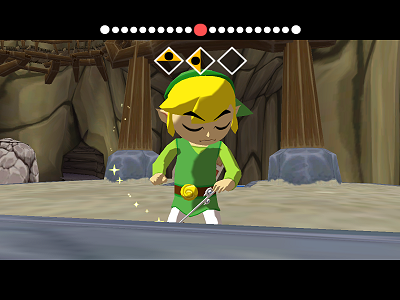

***“Wind! Stop!”***

My naked 3 year old rushes around the barn, his breath catapulting out his lungs. I secretively smirk as the same wind tussles my hair. Frustrated (or “flusterated” as he would say) he finally realizes it’s a command that won’t be honored and moves to the next task: muddy feet splooshing around our yard. 

I like to think I’m so different than a child who has been on earth for 3 revolutions, but I don’t think the amount of those revolutions necessarily mean much of anything when it comes to will. 

it’s windy here, often.

On these common days I’m looking out my American-sized backyard saying “are we crazy to give all this up?”

What we know to what we don’t know. 

from here, to there. America to Japan. With two kids. 

Tossed by this common wind inside and out. My brain goes back and forth. A seesaw of thoughts, up and down. 

Good for the boys, or wait…not good for them? Good for us, good for me? What is good, wait okay let’s define good. 

As if an army general is exploding into the tent talking war strategies:

“Alright, you have two options here. JT will grow up in Japan, he’ll hate it and he’ll resent you for it. But he will be safe. Or another tactic, he will grow up in America, typical American life meets typical American girl. But, joins the wrong crowd soon enough. Time to choose.”

But let’s define good.

But let’s define good.

Is good always what we know? Here’s what I don’t know: a lot. 

I don’t know what the future, what the war strategy is for my boys, marriage, myself. But, I know God and he’s the commander. 

So it goes. 

So, I’m not *commanding the wind.*