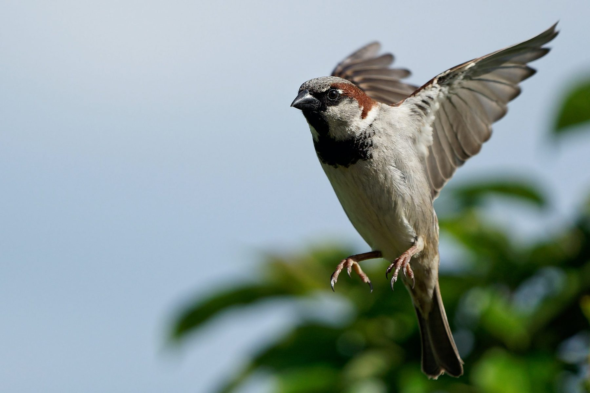

So I like to draw birds. 

I’m really into birds now. A birder kind of. 
So I’m being really curious with myself: “Now Emma, why birds?”

I don’t know if there has to be a why. 

I’m reading a book on birds and they truly impress me. Their complex songs they pass down from their fathers, their monogamy(and infidelity), and the bird trinkets they fill their nests with to entice the lady birds. 
This wholistic and rich world right above me. 
So ordinary but so unknown by me. 

This is what impresses me about humans: We want to learn. We start off silently listening to voices, watching their mouths move. Behind a blank drooling baby gaze are neurons multiplying in rapid succession. We watch and then do. Soon we can speak, soon we put our feet on the ground and soon we run. 

This is what impresses me about birds:
The ones who thrive are the ones who adapt to change and are willing to try currently unfamiliar things. 

And I wonder if there are some commonalities between the two? Would I do well to take a page from the adaptive house sparrow, who is known for cleverness and penchant for the new? I’ve passed on from a toddling toddler, an inquisitive teenager —and moved into an “established” woman, mom, wife, nurse in my thirties. And I don’t want to get stuck in “established”— I don’t want to lose my love for learning and living the new. 

I love the jolt to the system it gives. All of the sudden your world becomes different for a minute— a new puzzle piece and where does it fit? It’s like a part of my brain lights up and I receive energy from it. 

So maybe that’s why birds have piqued my interest at the moment; they inspire me to explore new and unfamiliar things. To not lose my love of experiencing a new culture, a new personal challenge. When I’m at a time in my life that I could settle into the known, or embrace what’s unknown. I’ll think I’ll do just that today.